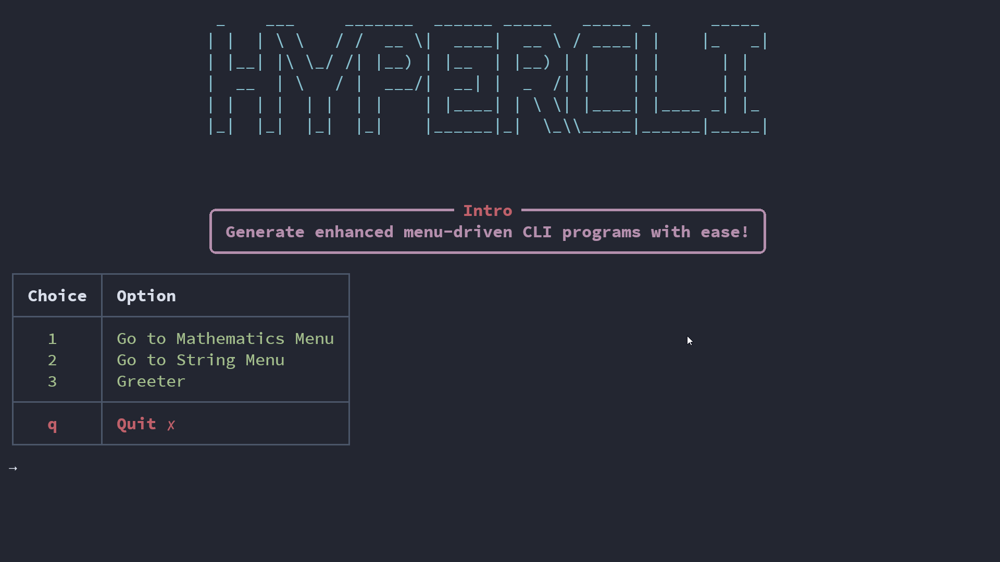

---
hide:
- navigation
---


<h1 align="center">hypercli</h1>

<p align="center">

<a src="https://pypi.org/project/hypercli/" target="_blank">

</a>
</p>

**hypercli** is a Python package that provides an elegant solution for interacting with command line tools. It offers a menu-based command line interface (CLI) that allows users to navigate through different options and execute functions based on their choices.

## Features

- Generate menu-driven CLI programs with ease using decorators
- Customize the menus, options, and visual styles according to your requirements
- Supports nested menus and navigation between menus

## Installation

You can install **hypercli** using pip. Open your terminal and run the following command:

```bash
pip install hypercli
```

## Usage

To use **hypercli**, import the `Hypercli` module from the `hypercli` package and create an instance of the `Hypercli` class. You can then define your menus, options, and functions to be executed. Finally, call the `run()` method to start the CLI interface.

Use the [Wiki](./Wiki.md) for more information on the configs, methods, and resources available in **hypercli**.

Here's an example of how to use **hypercli**:

```python
# import hypercli
from hypercli import Hypercli

# create an instance of hypercli
cli = Hypercli()

# configure the instance
cli.config["banner_text"] = "HYPERCLI"
cli.config["intro_title"] = "Intro"
cli.config["intro_content"] = "Generate enhanced menu-driven CLI programs with ease!"
cli.config["show_menu_table_header"] = True

# add navigation options to the menu
cli.link("Main Menu", "Mathematics Menu")
cli.link("Main Menu", "String Menu")


@cli.entry(menu="Main Menu", option="Greeter")
def greet():
    name = input("Enter your name: ")
    print(f"Hello, {name}!")


@cli.entry(menu="Mathematics Menu", option="Add two numbers")
def add(num1=1, num2=1):
    a = int(input(f"Enter first number (default {num1}): ") or num1)
    b = int(input(f"Enter second number (default {num2}): ") or num2)
    print(f"{a} + {b} = {a + b}")


@cli.entry(menu="Mathematics Menu", option="Subtract two numbers")
def sub(num1=1, num2=1):
    a = int(input(f"Enter first number (default {num1}): ") or num1)
    b = int(input(f"Enter second number (default {num2}): ") or num2)
    print(f"{a} - {b} = {a - b}")


@cli.entry(menu="String Menu", option="Reverse a string")
def reverse():
    string = input("Enter a string: ")
    print(string[::-1])


@cli.entry(menu="String Menu", option="Show length of a string")
def str_length():
    string = input("Enter a string: ")
    print(f"Length of string is {len(string)}")


# run the cli
cli.run()

```



## License

This project is licensed under the MIT License.
